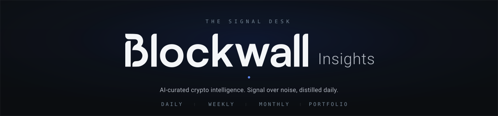

  

SIGNAL OVER NOISE · CRYPTO INTELLIGENCE · FRANKFURT

Blockwall Insights reads 100+ crypto and Web3 sources every day and distills them into scannable, VC-grade briefings — for founders, investors, and serious Web3 professionals. A research desk, not a hype blog: clear, sourced, and built to be read in minutes. Four cadences, one editorial standard.

 

<b>Four feeds, one desk</b>

<table align="center">
  <thead>
    <tr>
      <th align="left">Cadence</th>
      <th align="left">What it carries</th>
      <th align="right">Read</th>
    </tr>
  </thead>
  <tbody>
    <tr>
      <td><b>Daily</b></td>
      <td>The tape, plus the day's top signals</td>
      <td align="right">~2 min</td>
    </tr>
    <tr>
      <td><b>Weekly</b></td>
      <td>The week that mattered, in full context</td>
      <td align="right">~8 min</td>
    </tr>
    <tr>
      <td><b>Monthly</b></td>
      <td>The month in depth — themes, not headlines</td>
      <td align="right">~15 min</td>
    </tr>
    <tr>
      <td><b>Portfolio</b></td>
      <td>Moves across ~24 portfolio companies</td>
      <td align="right">weekly</td>
    </tr>
  </tbody>
</table>

 

  <a href="https://dt-vc.github.io/blockwall-insightsv2.1/"><b>Open the platform →</b></a>
  &nbsp;&nbsp;·&nbsp;&nbsp;
  <a href="https://insights.blockwall.vc"><b>Subscribe to the newsletter →</b></a>

  
    Built by <a href="https://www.blockwall.vc"><b>Blockwall Management GmbH</b></a> · Frankfurt, Germany · European Crypto Venture Capital 
    <a href="https://x.com/blockwall_vc">X</a> &nbsp;·&nbsp; <a href="https://www.linkedin.com/company/blockwall/">LinkedIn</a>
  

